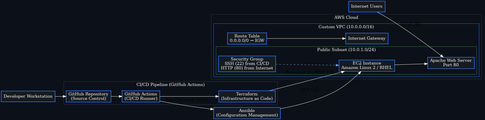

# 🚀 Automated Linux Infrastructure Lab  
A production‑style Infrastructure‑as‑Code project that provisions, configures, and validates a secure Linux web server on AWS using Terraform, Ansible, and a CI/CD pipeline.

## 🏗️ Architecture Diagram  



---

## 📌 Executive Summary  
This project implements a fully automated cloud infrastructure workflow that mirrors real DevOps and platform engineering practices. It provisions AWS resources using Terraform, configures a Linux server using Ansible, and enforces repeatability, security, and scalability through automation.

The result is a **zero‑touch deployment pipeline** capable of standing up a functional Apache web server on AWS with no manual configuration.

---

## 🧠 High‑Level Architecture  
**Developer → GitHub → GitHub Actions → Terraform → AWS VPC → EC2 → Ansible (SSH) → Apache Web Server**

### 🔍 What’s happening under the hood  
- **Terraform** builds the AWS environment (VPC, subnet, route table, IGW, security group, EC2).  
- **GitHub Actions** runs Terraform automatically on push (CI/CD).  
- **Ansible** connects via SSH to configure the EC2 instance.  
- **Apache** is installed, enabled, and served publicly.  
- **Security groups** restrict inbound traffic to only what’s required.  
- **Infrastructure is fully reproducible** and can be destroyed in seconds.

This is the same pattern used in real production environments — just scoped to a single‑server architecture.

---

## 🛠️ Technologies & Tools  
| Category | Tools |
|---------|-------|
| Infrastructure as Code | Terraform |
| Configuration Management | Ansible |
| Cloud Provider | AWS (EC2, VPC, IGW, SG) |
| OS / Platform | Linux (Amazon Linux 2 / RHEL) |
| Networking | SSH, HTTP |
| Version Control | Git & GitHub |
| CI/CD | GitHub Actions |

---

## ⚙️ Key Features  
- Automated provisioning of AWS compute and networking resources  
- Secure SSH access using key‑based authentication  
- Automated server configuration using Ansible playbooks  
- Apache web server deployment with zero manual steps  
- CI/CD pipeline for Terraform plan/apply  
- Cost‑controlled lifecycle (easy teardown with `terraform destroy`)  
- Clean, modular project structure suitable for scaling  

---

## 🔐 Security Considerations  
- SSH key‑based authentication (no passwords)  
- Security groups restrict inbound traffic to SSH + HTTP  
- Sensitive files excluded via `.gitignore`  
- Terraform state handled locally (can be upgraded to remote backend)  
- Principle of least privilege applied to network access  

---

## 📂 Project Structure  
```
linux-infra-lab/
│
├── terraform/
│   ├── ec2.tf
│   ├── variables.tf
│   └── outputs.tf
│
├── ansible/
│   ├── inventory
│   └── webserver.yml
│
├── architecture.dot
├── linux_infra_architecture.png
└── README.md
```

---

## 🚀 Deployment Workflow  

### **1. Provision AWS Infrastructure (Terraform)**  
```bash
terraform init
terraform apply
```

Creates:  
- EC2 instance  
- Security group  
- Networking components (VPC, subnet, IGW, route table)

---

### **2. Configure the Server (Ansible)**  
```bash
ansible-playbook -i inventory webserver.yml
```

Automates:  
- Apache installation  
- Service enablement  
- Basic hardening  

---

### **3. Validate Deployment**  
Open in a browser:

```
http://<PUBLIC_IP>
```

You should see the Apache default page.

---

### **4. Destroy Infrastructure (Cost Control)**  
```bash
terraform destroy
```

---

## 📜 Example Terraform Resource  
```hcl
resource "aws_instance" "linux_server" {
  ami           = "ami-xxxxxxxx" # Region-specific AMI
  instance_type = "t3.micro"
  key_name      = "linux-lab-key"

  tags = {
    Name = "LinuxLabServer"
  }
}
```

---

## 📜 Example Ansible Playbook  
```yaml
- name: Configure Web Server
  hosts: web
  become: yes

  tasks:
    - name: Install Apache
      yum:
        name: httpd
        state: present

    - name: Start Apache
      service:
        name: httpd
        state: started
        enabled: true
```

---

## 🎯 Key Learning Outcomes  
- Built a fully automated cloud deployment pipeline  
- Applied Infrastructure as Code (IaC) principles using Terraform  
- Automated server configuration using Ansible  
- Strengthened understanding of AWS networking and security  
- Practiced CI/CD automation with GitHub Actions  
- Gained hands‑on experience with Linux server administration  
- Demonstrated ability to design and document real‑world infrastructure  

---

## 📄 Resume‑Ready Bullet Points  
- Designed and deployed automated AWS infrastructure using Terraform (IaC)  
- Implemented configuration management with Ansible to provision Apache web servers  
- Built a CI/CD pipeline using GitHub Actions to automate Terraform workflows  
- Secured cloud resources using SSH key pairs and restrictive security groups  
- Documented architecture and deployment workflows for maintainability and scalability  

---

## 🔥 Future Enhancements  
- Restrict SSH access to a specific IP range  
- Add HTTPS using Let’s Encrypt  
- Introduce Terraform modules for multi‑environment deployments  
- Expand CI/CD pipeline to include Ansible automation  
- Add CloudWatch monitoring and logging  
- Scale to multi‑tier architecture with load balancing  

---

## ✅ Conclusion  
This project demonstrates the ability to design, automate, and manage cloud infrastructure using industry‑standard DevOps tools. It reflects practical experience with IaC, configuration management, CI/CD, cloud networking, and secure system design — all essential skills for modern DevOps and platform engineering roles.
